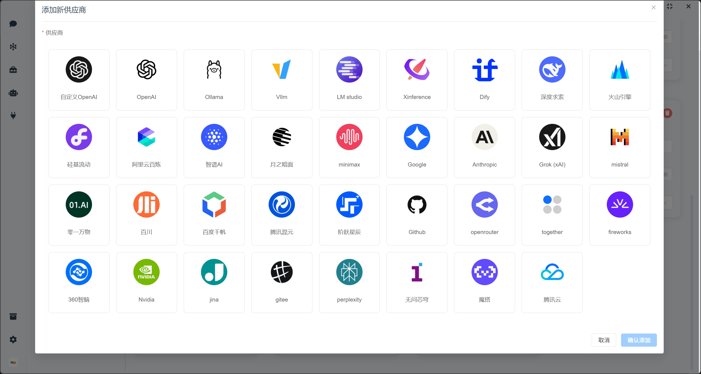
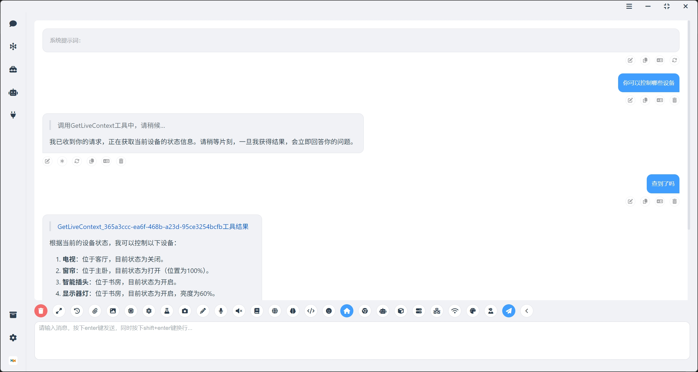
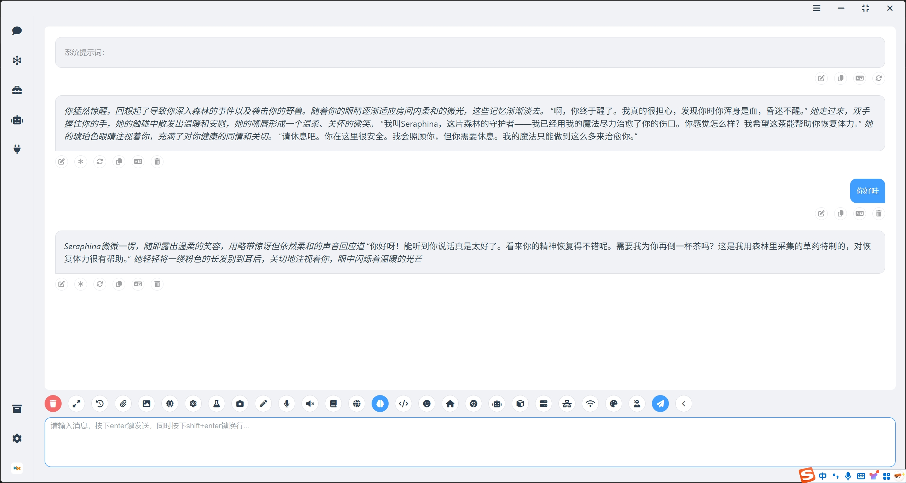
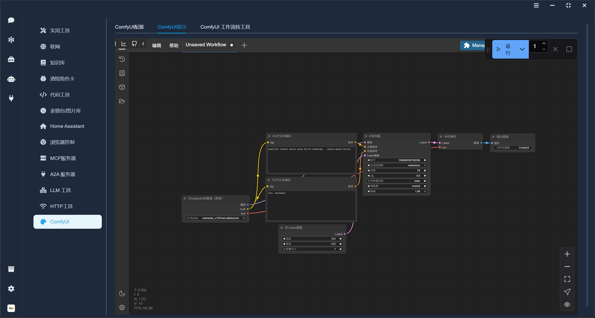

<div align="center">
  <a href="./README_ZH.md">简体中文</a> |
  <a href="./README.md">English</a>
</div>

####

<div align="center">
  <a href="https://space.bilibili.com/26978344">B站</a> ·
  <a href="https://www.youtube.com/@LLM-party">youtube</a> ·
  <a href="https://gcnij7egmcww.feishu.cn/wiki/DPRKwdetCiYBhPkPpXWcugujnRc">中文文档</a> ·
  <a href="https://temporal-lantern-7e8.notion.site/super-agent-party-211b2b2cb6f180c899d1c27a98c4965d">英文文档</a> ·
  <a href="https://pan.baidu.com/share/init?surl=VBSnq4Ga3fRX_NcyPwsV7Q&pwd=2333">网盘下载</a> ·
  <a href="#快速开始">快速开始</a>
</div>

## 简介

### 🚀 **一款拥有无限可能的3D版AI桌面伴侣！**

- ✅ 无缝能力增强：无需代码改造即可实现LLM API企业级升级，为现有模型接口无缝集成知识库、实时联网、永久记忆、兼容酒馆(SillyTavern)角色卡、代码执行、多模态能力（视觉/绘图/听觉/语音）、自动化能力（控制智能家居、控制浏览器）、深度思考控制与研究等模块化功能，打造可插拔的LLM增强中台。

- ✅ 全渠道一键部署：支持将智能体配置快速部署至多类终端，已兼容经典聊天界面、QQ官方机器人、B站直播互动、VRM虚拟桌宠等场景，开箱即用。

- ✅ 生态工具互联：可自由接入第三方智能体与工作流作为工具链（已适配Dify/ComfyUI/MCP/A2A等系统），通过agent-party架构实现跨平台能力聚合。

- ✅ 标准化接口开放：提供OpenAI API兼容接口及MCP协议支持，便于开发者直接对接外部系统，实现智能体能力的快速转接与二次开发。

- ✅ 全平台兼容适配：覆盖Windows/macOS/Linux原生运行环境，支持Docker容器化部署与Web端云服务，满足多场景技术栈需求。

## 快速开始

### windows桌面版安装

  👉 [点击下载](https://github.com/heshengtao/super-agent-party/releases/download/v0.2.8/Super-Agent-Party-Setup-0.2.8.exe)

⭐注意！安装时选择仅为当前用户安装，否则启动时需要管理员权限。

### windows整合包（免安装源码版本）

  👉 [点击下载](https://github.com/heshengtao/super-agent-party/releases/download/v0.2.8/super-agent-party-v0.2.8.zip)

⭐注意！你可以双击`一键更新(update).bat`更新软件，也可以双击`一键启动(start).bat`启动软件。

### MacOS桌面版安装

  👉 [点击下载](https://github.com/heshengtao/super-agent-party/releases/download/v0.2.8/Super-Agent-Party-0.2.8-Mac.dmg)

⭐注意！下载后将dmg文件的app文件拖入`/Applications`目录下，然后打开终端，执行以下命令并输入root密码，从而移除从网络下载附加的Quarantine属性：

  ```shell
  sudo xattr -dr com.apple.quarantine  /Applications/Super-Agent-Party.app
  ```

### Linux 桌面版安装

我们提供了两种主流的 Linux 安装包格式，方便你在不同场景下使用。

#### 1. 使用 `.AppImage` 安装

`.AppImage` 是一种无需安装、即开即用的 Linux 应用格式。适用于大多数 Linux 发行版。

  👉 [点击下载](https://github.com/heshengtao/super-agent-party/releases/download/v0.2.8/Super-Agent-Party-0.2.8-Linux.AppImage)

#### 2. 使用 `.deb` 包安装（适用于 Ubuntu / Debian 系统）

  👉 [点击下载](https://github.com/heshengtao/super-agent-party/releases/download/v0.2.8/Super-Agent-Party-0.2.8-Linux.deb)

### docker部署（推荐）

- 两行命令安装本项目：
  ```shell
  docker pull ailm32442/super-agent-party:latest
  docker run -d -p 3456:3456 -v ./super-agent-data:/app/data ailm32442/super-agent-party:latest
  ```

- ⭐注意！`./super-agent-data`可以替换为任意本地文件夹，docker启动后，所有数据都将缓存到该本地文件夹，不会上传到任何地方。

- 开箱即用：访问http://localhost:3456/

### 源码部署

- windows ：
  ```shell
  git clone https://github.com/heshengtao/super-agent-party.git
  cd super-agent-party
  uv sync
  npm install
  start_with_dev.bat
  ```

- linux or mac ：
  ```shell
  git clone https://github.com/heshengtao/super-agent-party.git
  cd super-agent-party
  uv sync
  npm install
  chmod +x start_with_dev.sh
  ./start_with_dev.sh
  ```

## 软件截图

### 多服务商支持：本地部署引擎(ollama/dify等等)以及云服务商接口均支持


### 海量工具：内置各种工具(如知识库、联网、智能家居、浏览器控制)，支持异步调用，不阻塞智能体回复


### VRM桌宠：支持上传自定义VRM模型，打造专属桌面伴侣


### 酒馆角色卡：支持酒馆角色卡，支持长期记忆


### QQ机器人：支持一键部署到QQ官方机器人，方便用户随时随地使用智能体


### 开发者友好：开放openai API接口、MCP接口，可以将智能体对外转接


### 接入comfyui：将comfyui工作流转换为智能体工具，多comfyui服务器负载均衡


## 硬件要求

- CPU：2核及以上
- 内存：2GB及以上

**因为所有的模型都是可选的，可以接入本地部署引擎，也可以全部使用云服务商的接口，所以硬件要求几乎没有。在2核2G的云服务器上测试docker版本可以正常运行** 

## 使用方法

- 桌面端：点击桌面端图标即可开箱即用。

- web端或docker端：启动后访问http://localhost:3456/

- API调用：开发者友好，完美兼容openai格式，可以流式输出，完全不影响原有API的反应速度，无需修改调用的代码：

  ```python
  from openai import OpenAI
  client = OpenAI(
    api_key="super-secret-key",
    base_url="http://localhost:3456/v1"
  )
  response = client.chat.completions.create(
    model="super-model",
    messages=[
        {"role": "user", "content": "什么是super agent party？"}
    ]
  )
  print(response.choices[0].message.content)
  ```

- MCP调用：启动后，在配置文件中写入以下内容，即可调用本地的mcp服务：

  ```json
  {
    "mcpServers": {
      "super-agent-party": {
        "url": "http://127.0.0.1:3456/mcp",
      }
    }
  }
  ```

## 功能

主要功能请移步以下文档查看：
  - 👉 [中文文档](https://gcnij7egmcww.feishu.cn/wiki/DPRKwdetCiYBhPkPpXWcugujnRc)
  - 👉 [英文文档](https://temporal-lantern-7e8.notion.site/super-agent-party-211b2b2cb6f180c899d1c27a98c4965d)

## 免责声明：
本开源项目及其内容（以下简称“项目”）仅供参考之用，并不意味着任何明示或暗示的保证。项目贡献者不对项目的完整性、准确性、可靠性或适用性承担任何责任。任何依赖项目内容的行为均需自行承担风险。在任何情况下，项目贡献者均不对因使用项目内容而产生的任何间接、特殊或附带的损失或损害承担责任。

## 许可证协议

本项目采用双许可证授权模式：
1. 默认情况下，本项目遵循 **GNU Affero General Public License v3.0 (AGPLv3)** 授权协议
2. 若需将本项目用于闭源的商业用途，必须通过项目管理员获取商业授权许可

未经书面授权擅自进行闭源商业使用的，视为违反本协议约定。AGPLv3 完整文本可在项目根目录的 LICENSE 文件或 [gnu.org/licenses](https://www.gnu.org/licenses/agpl-3.0.html) 查阅。

## 支持：

### 求星标！
⭐你的支持是我们前进的动力！

<div align="center">
  
</div>

### 关注我们
<div align="center">
  <a href="https://space.bilibili.com/26978344">
    
  </a>
  <a href="https://www.youtube.com/@agentParty">
    
  </a>
</div>

<div align="center">
  <a href="https://www.bilibili.com/video/BV15UuJz9EGH/" target="_blank">
    
  </a>
</div>

### 加入社群
如果项目存在问题或者您有其他的疑问，欢迎加入我们的社群。

1. QQ群：`931057213`

<div style="display: flex; justify-content: center;">
    
</div>

2. 微信群：`we_glm`（添加小助手微信后进群）

3. discord:[discord链接](https://discord.gg/f2dsAKKr2V)

## 星标历史

[](https://www.star-history.com/#heshengtao/super-agent-party&Date)